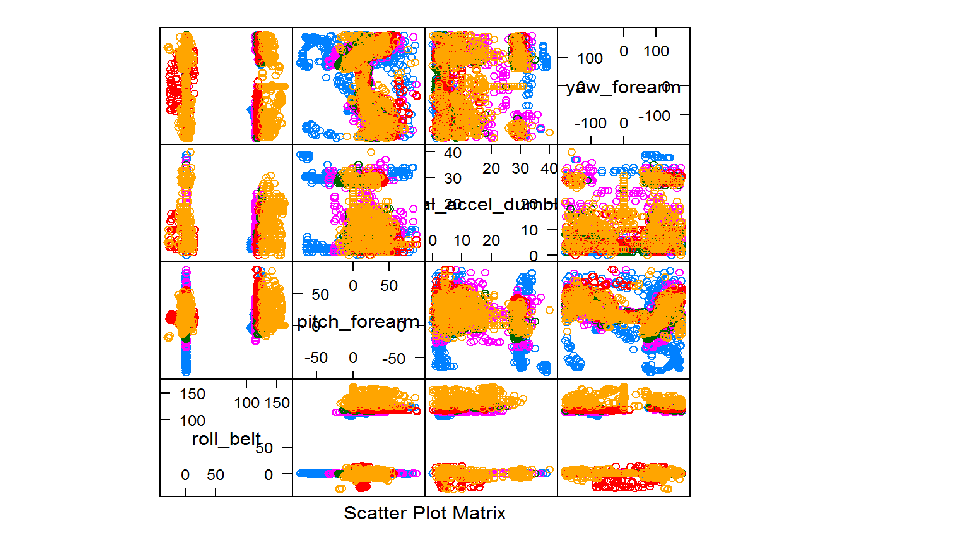

## Human Activity Recognition (HAR)

1. A key research area
2. Many potential applications for HAR, like: elderly monitoring, life log systems 
3. Data: http://groupware.les.inf.puc-rio.br/har#dataset
4. 5 classes (sitting-down, standing-up, standing, walking, and sitting) 
5. Collected on 8 hours of activities of 4 healthy subjects.


```r
library(randomForest)
traindata <- read.csv("training.csv")
head(traindata[1:4,1:4])
```

```
##   X.1  X user_name raw_timestamp_part_1
## 1   9  9  carlitos           1323084232
## 2  36 36  carlitos           1323084233
## 3  39 39  carlitos           1323084233
## 4  50 50  carlitos           1323084233
```

---

## Random Forest

1. A popular classification model
2. Selection of a random subset of features
3. Decision tree learning
4. Tree bagging 
5. ```library(randomForest)```

---

## Analysis on features


---

## Prediction Accuracy

5-Fold cross-validation accuracy:

1. cv 1 acc: 99.0061162079511 %
2. cv 2 acc: 98.7257900101937 %
3. cv 3 acc: 99.1590214067278 %
4. cv 4 acc: 99.2609582059123 %
5. cv 5 acc: 99.0316004077472 %


